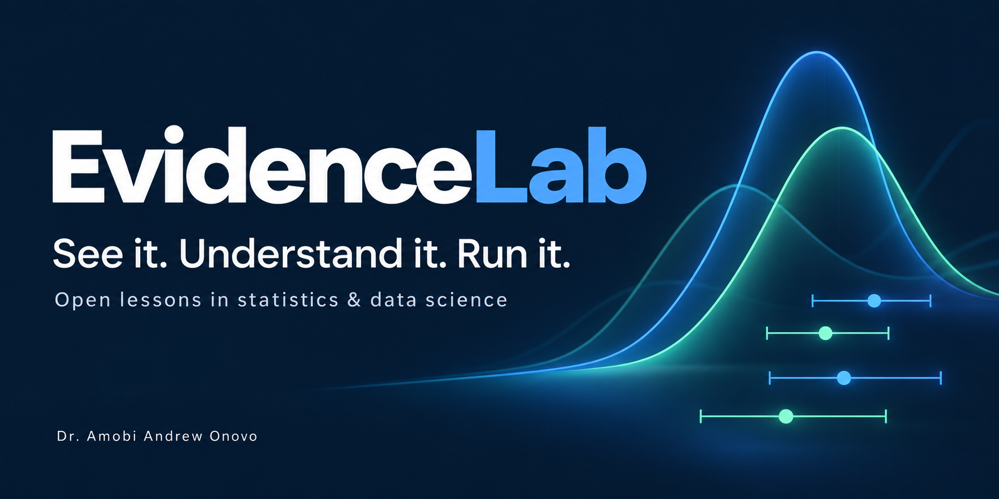
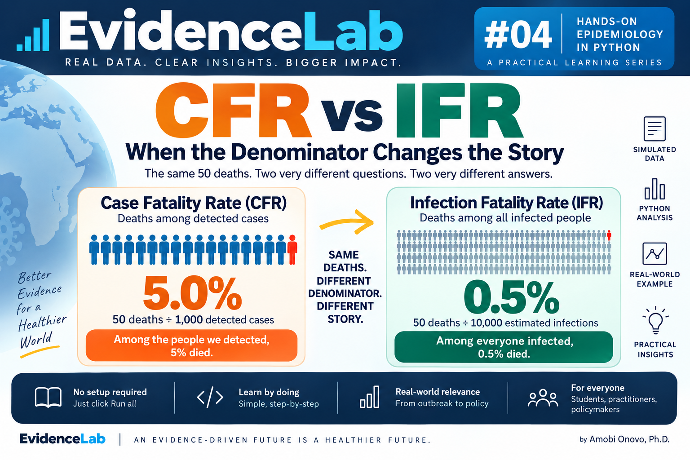
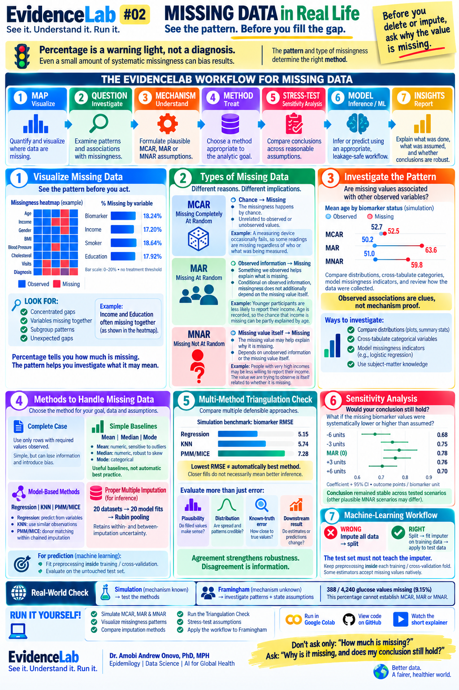
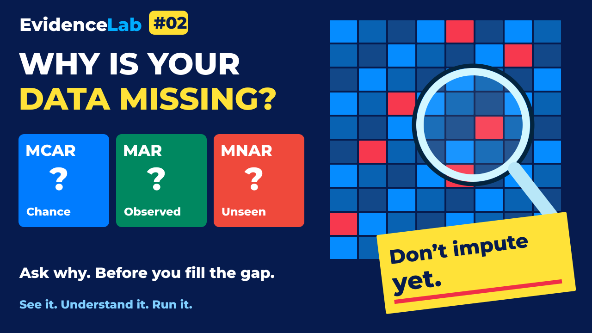
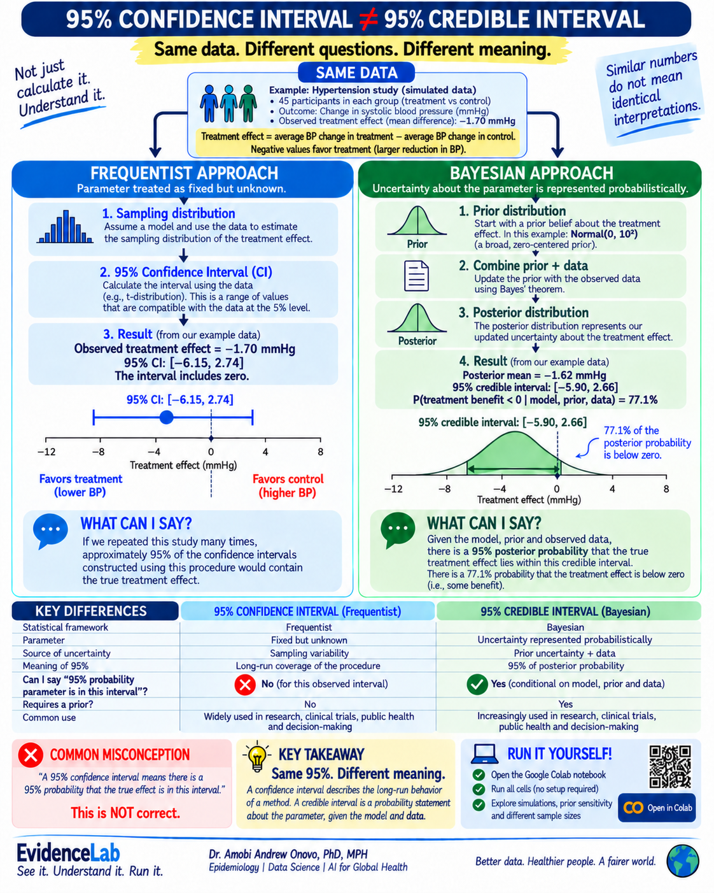

# EvidenceLab

## See it. Understand it. Run it.

EvidenceLab is an open educational project designed to make quantitative methods easier to understand, interpret, and apply.

[Start Lesson 01](lessons/01-confidence-vs-credible-interval/README.md) · [View the notebook](lessons/01-confidence-vs-credible-interval/confidence_vs_credible_intervals.ipynb)

Each lesson combines:

- **See it:** A visual explainer that makes the central idea intuitive.
- **Understand it:** A plain-language explanation of what the method means, what it does not mean, and why the distinction matters.
- **💻 Run it:** A reproducible Python notebook with simulations, worked examples, visualizations, and experiments that learners can modify themselves.

Created by **Dr. Amobi Andrew Onovo, PhD, MPH**  
Epidemiology | Data Science | AI for Global Health

## Lesson 04: CFR vs IFR

**When the Denominator Changes the Story.** The same 50 deaths: 5% among 1,000 detected cases,
or 0.5% among 10,000 estimated infections. Learn how to obtain and evaluate the denominator.

[Explore Lesson 04](lessons/04-cfr-vs-ifr/README.md) · [View the notebook](lessons/04-cfr-vs-ifr/EvidenceLab_04_CFR_vs_IFR_FINAL.ipynb)

*Synthetic example with completed follow-up; person icons are illustrative.*

## Lesson 03: Competing Risks

**When Another Event Gets There First.** Define the event, identify what can happen first, choose the estimand, then choose the model.

[Explore Lesson 03](lessons/03-competing-risks/README.md) · [View the notebook](lessons/03-competing-risks/competing_risks.ipynb)

[Watch the competing-risks explainer on YouTube](https://youtu.be/K4AsjUVrxmk).

## Lesson 02: Missing Data in Real Life

**See the pattern. Before you fill the gap.**

Learn with two hands-on tracks: simulate MCAR, MAR and MNAR with known truth, then investigate missingness in a Framingham teaching dataset. Compare methods, stress-test assumptions, and prevent machine-learning leakage.

[Explore Lesson 02](lessons/02-missing-data/README.md) · [View the notebook](lessons/02-missing-data/missing_data.ipynb)

### Watch Lesson 02

[Watch the missing-data explainer on YouTube](https://youtu.be/FQw8KHLwz7E).

## Lesson 01: 95% Confidence Interval vs 95% Credible Interval

### Same 95%. Different meaning.

**Same data. Different questions. Different meaning.**

A 95% confidence interval and a 95% Bayesian credible interval may look numerically similar, but the “95%” refers to fundamentally different uncertainty statements.

**Frequentist:** The parameter is treated as fixed but unknown. The 95% describes the long-run coverage of the interval-generating procedure under repeated sampling and the model assumptions.

**Bayesian:** Uncertainty about the parameter is represented probabilistically. A 95% credible interval contains 95% of the posterior probability, conditional on the specified model, prior, and observed data.

**Same data. Different questions. Different interpretation.**

[Explore Lesson 01](lessons/01-confidence-vs-credible-interval/README.md) · [View the notebook](lessons/01-confidence-vs-credible-interval/confidence_vs_credible_intervals.ipynb)

### Run the lesson

1. Click **Open in Colab**.
2. Select **Runtime > Run all**.
3. No setup is required in the standard Python Colab runtime.
4. Follow the explanations, tables, and figures.
5. Change the sample size (`N_PER_GROUP`), true effect (`TRUE_EFFECT`), or prior (`PRIOR_SD`).
6. Run all again and observe what changes.

## What you will learn

By completing Lesson 01, you should be able to:

- Explain what a treatment effect means.
- Calculate and interpret a 95% confidence interval.
- Identify the misconception that a particular frequentist CI gives a 95% probability for the fixed parameter.
- Explain prior, likelihood, and posterior.
- Calculate and interpret a 95% credible interval.
- Understand why CI and credible interval interpretations differ.
- Observe frequentist coverage through 1,000 simulated studies.
- Explore prior sensitivity.
- Explore the effect of sample size on uncertainty.
- Interpret posterior probability of benefit.
- Understand why statistical evidence does not automatically determine a public health decision.

## The simulated study

Lesson 01 uses a simulated hypertension study. **All data are simulated for educational purposes. No observations represent real patients or a real clinical trial.** The notebook generates 45 participants per group with a true simulated mean effect of −3.0 mmHg.

**Treatment effect = average BP change in treatment group − average BP change in control group.**

Negative values favor treatment because they represent a larger reduction in systolic blood pressure. The notebook compares a Welch t confidence interval with a Bayesian credible interval based on a normal approximation and a Normal(0, 10²) prior.

## How EvidenceLab works

**SEE IT → UNDERSTAND IT → RUN IT**

1. **See it:** Start with an infographic that shows the central idea and the question it answers.
2. **Understand it:** Read the interpretation, assumptions, and common misconceptions in plain language.
3. **Run it:** Execute the Python tutorial, change assumptions, and explore how the results respond.

## Topics

EvidenceLab's planned topics include epidemiology, biostatistics, Bayesian statistics, statistical inference, clinical research methods, public health analytics, causal inference, data science, machine learning, and AI for health.

## Who is EvidenceLab for?

EvidenceLab is designed for students, researchers, clinicians, epidemiologists, biostatisticians, public health professionals, program managers, data scientists, and anyone interested in understanding quantitative evidence.

## Lesson 01 reproducibility

- Python is used throughout, with NumPy, pandas, Matplotlib, and SciPy.
- Random seeds are fixed: `20260909` for the example study and `20260910` for repeated studies.
- Data are generated inside the notebook; no external dataset, API key, or patient data is used.
- No paid package is required.
- The notebook is designed for Google Colab and sequential **Run all** execution.
- Changing parameters changes results; reset them to reproduce the original example.

For a local Jupyter environment, install the lesson dependencies with `pip install -r requirements.txt`, then open the notebook using your preferred notebook application. Jupyter is a separate local development tool; it is already provided by Colab.

## Lesson directory

| Lesson | Topic | Materials |
| --- | --- | --- |
| 01 | 95% Confidence Interval vs 95% Credible Interval | [Explanation, infographic, and notebook](lessons/01-confidence-vs-credible-interval/README.md) |
| 02 | Missing Data in Real Life | [Explanation, infographic, and notebook](lessons/02-missing-data/README.md) |

Future lessons can follow the same numbered folder structure under `lessons/`.

## Educational disclaimer

EvidenceLab is an educational resource. Examples and simulated datasets are intended for teaching statistical concepts and should not be interpreted as clinical recommendations or evidence about the effectiveness of any real treatment.

## License

Code is licensed under the [MIT License](LICENSE-MIT). Educational text, notebook explanations, and visual materials are licensed under [CC BY 4.0](https://creativecommons.org/licenses/by/4.0/). See [LICENSE](LICENSE) for scope and attribution.
