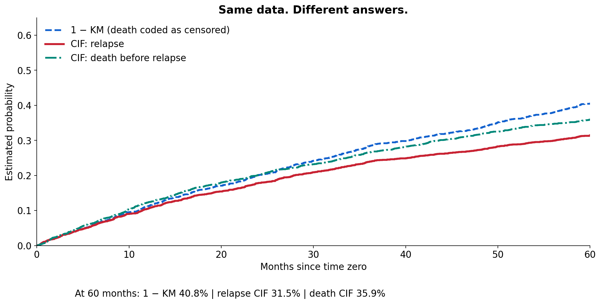
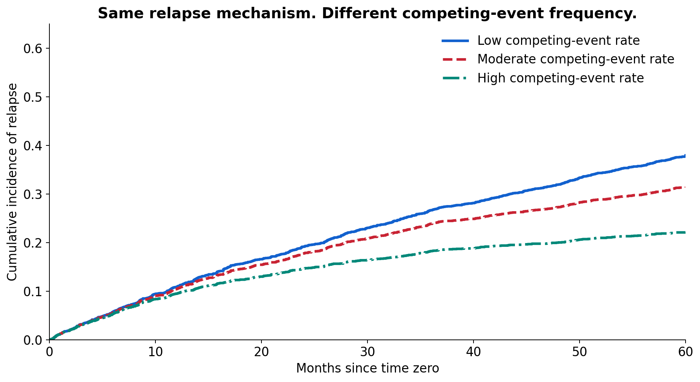

# EvidenceLab #03: Competing Risks
## When Another Event Gets There First

**Define the event → identify what can happen first → choose the estimand → then choose the model.**

Different models answer different questions.

[View the notebook](competing_risks.ipynb) · [Methods and sources](METHODS.md)

## Start here

1. Open the notebook in Google Colab.
2. Use a fresh standard Python runtime and choose **Runtime → Run all**.
3. Read the short explanations beside each code section.
4. Try increasing the competing-event multiplier, rerun, and explain why relapse cumulative incidence changes.

No upload, patient data, API key or Drive connection is required. The first cell installs lifelines 0.30.3. All data are simulated; allow a few minutes for the lesson to run. Download `evidencelab03_outputs` before your temporary runtime expires.

## What you will learn

- Define time zero, event of interest, competing event and censoring.
- Distinguish event-free survival from the probability of a specific event.
- Compare one minus Kaplan–Meier with cumulative incidence.
- Interpret cause-specific Cox associations and assess assumptions.
- Explain Fine–Gray without confusing a subdistribution hazard ratio with probability.
- Transfer the idea to employment, customer analytics and engineering.

## Same data. Different answers.

The notebook creates 2,500 artificial records. The endpoint is first cancer relapse; death before relapse competes. At 60 months, one minus KM with competing deaths coded as censored is approximately 40.8%, compared with 31.5% relapse CIF and 35.9% death-before-relapse CIF. These estimates are generated by the notebook, not clinical evidence and not calibration to the infographic's illustrative values.

The scenario experiment changes only the competing-event hazard multiplier using paired random draws. The primary-event mechanism stays fixed. This is a model-based teaching experiment, not a real intervention effect.

## Methods and limits

The executable analysis uses Kaplan–Meier, Aalen–Johansen cumulative incidence and cause-specific Cox. Fine–Gray is conceptual in this release; no fitted subdistribution HR is claimed. See [methods](METHODS.md) for assumptions and the established R `cmprsk::crr` reference. HRs and sHRs are neither probabilities nor risk ratios. Observational associations do not prove causality.

## The research story

During Dr. Amobi Andrew Onovo's PhD, Professor Olivia Keiser asked about competing risks. He studied the method and incorporated competing-risk regression into work presented at IAS 2017 in Paris, 23–26 July 2017. Abstract MOPEB0307 appears on printed page 79 of the [IAS abstract book](https://www.ias2017.org/Portals/1/Files/IAS2017_LO.compressed4c6a.pdf?fileticket=m3LSDs1z4QY%3d&tabid=577&portalid=1).

That historical analysis accounted for loss to follow-up using competing-risk regression. LTFU does not biologically prevent death; its analytic role depends on the estimand and study design. Missing vital status may require tracing, linkage, sensitivity analysis or a multi-state model. The supervisor conversation is the author's account. No claim that a method caused conference acceptance is made.

## Infographic

[Download the infographic with both verified QR codes](assets/competing_risks_infographic.png). Only the bottom notebook QR was corrected; the approved artwork and scientific content are preserved.

## Watch the lesson

YouTube publication is pending. A video link will be added after publication.

## Reproducibility

Seed: 201703. Clean Google Colab Run all: 20 of 20 code cells completed on 20 September 2026, with no errors. The learner source matched the downloaded executed notebook. Production cross-checks compared CIF/KM against scikit-survival, Cox against statsmodels, and direct risk-set recursion against hand-calculated cases. Package versions, simulation parameters, full-precision results and chart coordinates are exported by the notebook.

[Colab validation](colab_validation.json) · [Independent scientific checks](independent_science_checks.json) · [QR validation](qr_validation.json)

Dr. Amobi Andrew Onovo, PhD, MPH

**EvidenceLab | See it. Understand it. Run it.**
