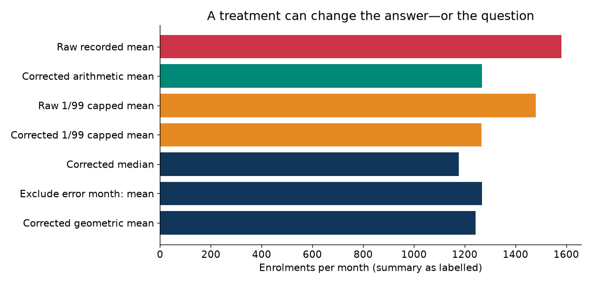
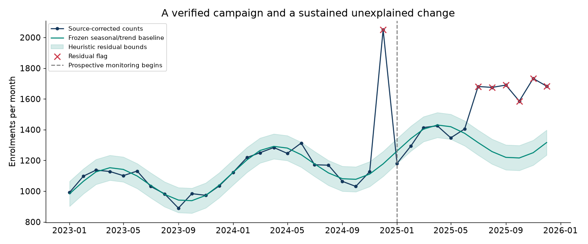
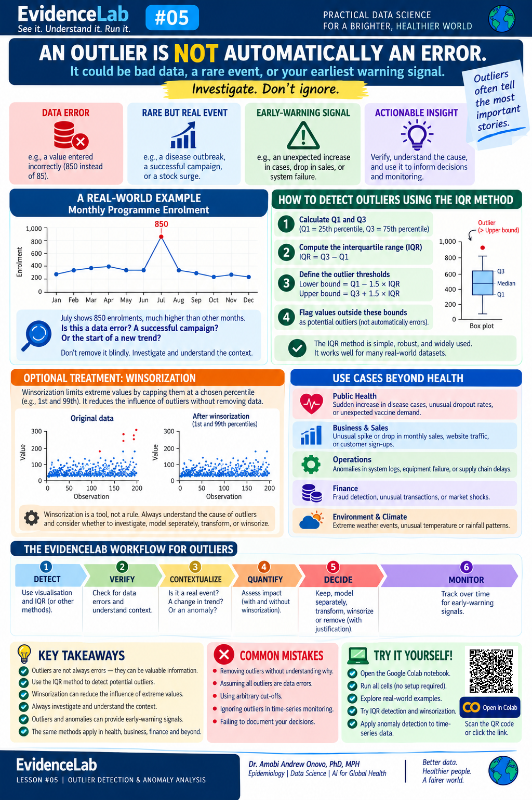
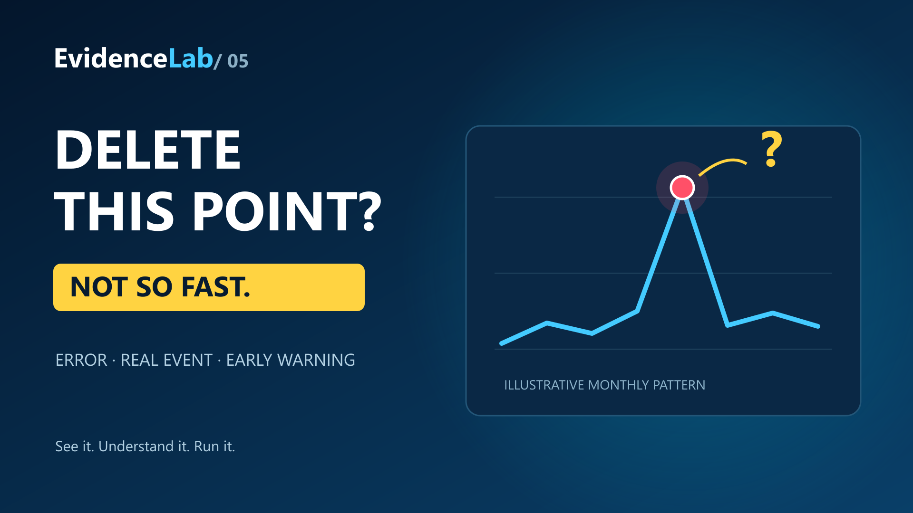

# EvidenceLab #05: When One Number Does Not Belong

**Outlier detection, anomaly investigation, and what to do next.**

An unusual value may be an error, a rare valid event, or an early-warning signal. Learn to calculate flags, verify their causes and document a defensible response.

[Open the notebook](EvidenceLab_05_Outliers_Anomalies_FINAL_v2.ipynb) · [Infographic PDF](assets/EvidenceLab_05_Infographic_FINAL.pdf)

Choose **Runtime → Run all**. The notebook generates all data and exports using NumPy, pandas and Matplotlib. No uploads, API keys, installation cells or prompts are required. Version 2 passed two fresh local kernels and hosted Colab Restart session and run all, with zero cell errors or warnings. At phone portrait width, the Colab editor requires horizontal scrolling; desktop or landscape is recommended.

## Notebook v2

The controlled teaching upgrade adds a beginner opening, eight-step roadmap, labeled boxplot anatomy, clearer interpretations and a decision aid. Original analyses and results are preserved. [QA report](EvidenceLab_05_NOTEBOOK_QA_FINAL.md) · [Original notebook](EvidenceLab_05_Outliers_Anomalies_FINAL.ipynb) · [V2 exports](outputs_v2/). The infographic QR and the Colab button both open notebook v2. The original notebook remains available through the link above.

## What you will learn

- Distinguish a distributional outlier, a contextual anomaly and a confirmed data error.
- Calculate quartiles, IQR fences and modified z-scores.
- Compare raw, corrected, capped and robust summaries without conflating their questions.
- Monitor residuals after accounting for trend and annual seasonality.
- Preserve original data, record treatment decisions and stress-test conclusions.

## Follow the evidence

**DETECT → VERIFY → CONTEXTUALIZE → QUANTIFY → DECIDE → STRESS-TEST → MONITOR**

IQR = Q3 − Q1. Lower fence = Q1 − 1.5 × IQR. Upper fence = Q3 + 1.5 × IQR.

Modified z = 0.67449 × (value − median) / MAD. Sample quantiles use linear interpolation. Both rules screen for unusual observations; neither establishes an error or authorizes deletion.

## Three events, three responses

The main example contains 36 fictional monthly enrolment counts, January 2023–December 2025, and 200 synthetic transaction amounts. A confirmed entry of 12,500 is corrected to 1,250. A documented campaign is retained. Six unexplained elevated months trigger investigation and monitoring. All source notes are simulated teaching evidence.

The raw mean is 1,580.36 enrolments/month; the source-corrected mean is 1,267.86. Raw capping at the 1st/99th percentiles leaves a mean of 1,479.57. Capping does not repair a known transcription error.

## From detection to monitoring

Whole-series IQR fences ignore time order. Our illustrative monitor fits trend and annual seasonality on the first 24 months after source correction, excludes the known campaign from baseline fitting, and freezes the baseline before monitoring months 25–36. Three consecutive positive residual flags first trigger a sustained alert in September 2025. Bounds are heuristic, not calibrated prediction intervals. Longer historical validation is needed for real deployment.

## Infographic

The owner supplied this artwork; only the Colab QR square was replaced. Its diagrams are conceptual illustrations, not plots of the 36-month notebook dataset. The 850-enrolment opening example is synthetic. The six-step infographic condenses the full workflow; the notebook explicitly adds stress-testing. A flag is not a deletion instruction. Winsorization preserves rows but changes values.

[Print PNG](assets/EvidenceLab_05_Infographic_Print.png) · [Editable QR overlay on supplied raster](assets/EvidenceLab_05_Infographic_Editable.svg) · [Standalone QR](assets/EvidenceLab_05_Colab_QR.png)

## Video preview

YouTube publication pending. This preview is not linked to an unpublished video.

## Reproducible outputs

`outputs/` contains the five-number summary, IQR flags, robust scores, treatment comparisons, audit log, monitoring table, sensitivity experiments, six figures and an analysis manifest. `data/` contains the synthetic monthly dataset. Seed: 20261002. Original observed values are preserved. The default path is fully static and has no widget dependency.

## Sources

- [NIST: Detection of Outliers](https://www.itl.nist.gov/div898/handbook/eda/section3/eda35h.htm)
- [NIST: Box Plot](https://www.itl.nist.gov/div898/handbook/eda/section3/boxplot.htm)
- [SciPy: Median Absolute Deviation](https://docs.scipy.org/doc/scipy/reference/generated/scipy.stats.median_abs_deviation.html)
- [SciPy: Trimming and Winsorization](https://docs.scipy.org/doc/scipy/tutorial/stats/outliers.html)

**Dr. Amobi Andrew Onovo, PhD, MPH**  
Epidemiology | Data Science | AI for Global Health  
**EvidenceLab | See it. Understand it. Run it.**
