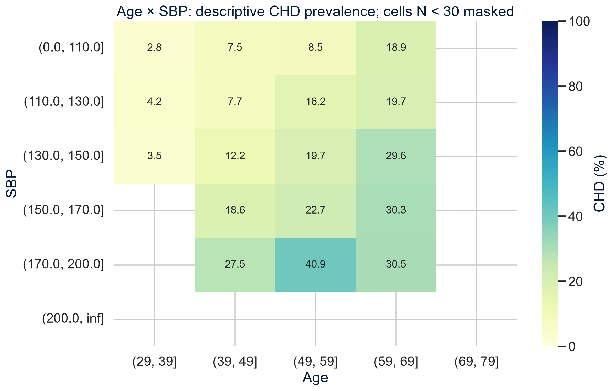
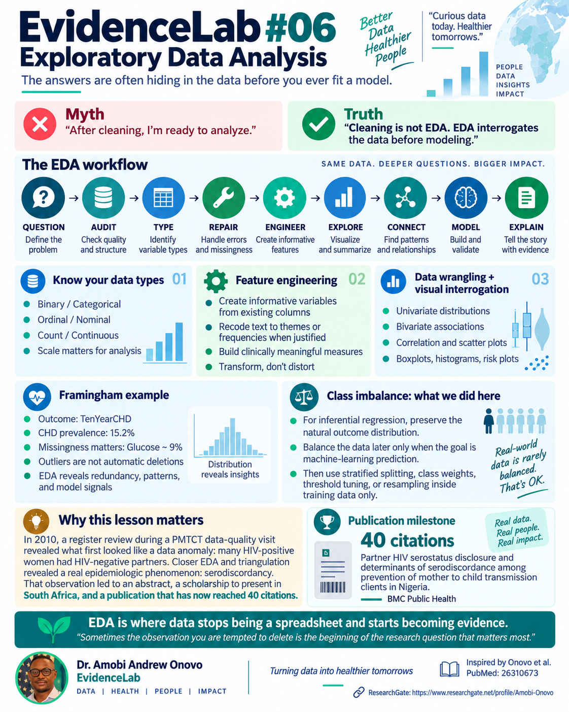

# EvidenceLab #06: Exploratory Data Analysis

**Investigate the pattern before you fit the model.**

Dr. Amobi Andrew Onovo · See it. Understand it. Run it.

Learn to audit data, identify variable types, investigate unusual values, engineer meaningful features and connect distributions and relationships to model specification. The Framingham teaching example distinguishes adjusted association from prediction and shows why class imbalance does not automatically call for resampling.

[Open in Google Colab](https://colab.research.google.com/github/amobionovo/EvidenceLab/blob/main/lessons/06-exploratory-data-analysis/EvidenceLab_06_Exploratory_Data_Analysis_Framingham_Interactive.ipynb) · [Interactive notebook](EvidenceLab_06_Exploratory_Data_Analysis_Framingham_Interactive.ipynb) · [Earlier static notebook](EvidenceLab_06_EDA_FINAL.ipynb)

Select **Runtime → Run all**, then read from top to bottom. The pinned teaching CSV downloads automatically and is checked by SHA-256. If the approved download fails, Colab requests the same CSV and verifies its SHA-256 before continuing. A different dataset is rejected. Source, filename, row count and column count are displayed. Generated evidence tables are saved under `outputs/`; interactive views and ten high-resolution PNG/SVG signature figures are saved under `evidencelab06_visuals/`.

## New to Colab?

Open the notebook and read **START HERE**. Choose **Runtime → Run all**, wait for completion, then follow **Step 0–9**. The glossary introduces the terms before analysis, and each code guide tells you what to click and expect. No Python editing or dataset upload is normally needed. After completion, change only the marked TRY IT variables. Advanced views are optional in the learning route. Kaleido is needed only for optional additional Plotly image export.

[Beginner accessibility QA](QA/Beginner_Accessibility_QA.md)

## Explore the interactive evidence

Use a distribution dropdown, outcome-stratified violins, age/BP scatter and prevalence surface, missingness suite, correlations, scatter matrix, outlier explorer, forest plot and apparent-calibration panel. Hover for denominators and recorded values. Descriptive and adjusted claims are labeled throughout.

[Signature exports](interactive_visuals/) · [Interactive QA](QA/Interactive_QA.md)

## Video preview

[Download thumbnail PNG](assets/eda_thumbnail_dont_delete.png) · [Download thumbnail JPG](assets/eda_thumbnail_dont_delete.jpg)

The explainer is prepared for review; YouTube publication is pending.

## Lesson infographic

## Follow the evidence

**QUESTION → AUDIT → TYPE → REPAIR → ENGINEER → EXPLORE → CONNECT → MODEL → EXPLAIN**

- 4,240 observations and 16 original variables.
- 644 recorded 10-year CHD outcomes: 15.2%.
- 388 missing glucose values: 9.15%.
- Complete-case association model: 3,658 participants; confidence intervals accompany adjusted odds ratios.
- Outlier flags call for investigation. Correlation calls for review of overlapping information.
- For prediction, split first; fit preprocessing and any resampling inside training folds. Select thresholds using validation data and evaluate on a locked test set.

[Numerical audit](Claim_Ledger.csv) · [Notebook QA](QA/Notebook_QA.md) · [Exported evidence](outputs/) · [Alternative thumbnail](assets/eda_thumbnail_signal.png)

## The research journey behind the lesson

The author's 2010 ANC/PMTCT register review prompted investigation of HIV serodiscordancy. The peer-reviewed paper reports a 2013 evaluation and was published in 2015. The infographic's 40-citation milestone is supplied by the author.

[Onovo AA and colleagues. Partner HIV serostatus disclosure and determinants of serodiscordance among prevention of mother to child transmission clients in Nigeria. BMC Public Health (2015), PMID 26310673.](https://pubmed.ncbi.nlm.nih.gov/26310673/)

Co-authors: Iboro Ekpo Nta, Aaron Anyebe Onah, Chukwuemeka Arinze Okolo, Ahmad Aliyu, Patrick Dakum, Akinyemi Olumuyiwa Atobatele and Pamela Gado.

The CSV is a teaching copy, not the full original Framingham Heart Study. Its provenance and source terms are documented in [Lesson 02](../02-missing-data/data/README.md). It is not relicensed here. Code and original educational material follow the repository's existing licenses.

**What unexpected pattern made you question your analysis?**
